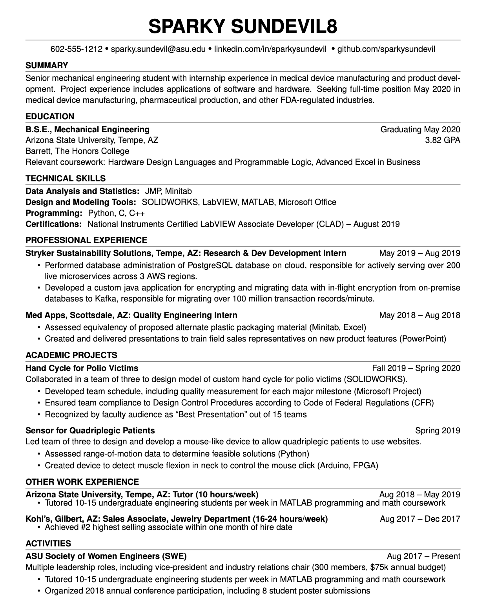
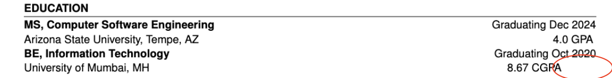

# The Sparky Sundevil template

This is a Latex template for the ASU Sparky Sundevil Resume.

<!-- Badges -->
[](https://www.overleaf.com/latex/templates/asu-resume-template/jtwpddspxjtm)
[](https://github.com/vgnshiyer/ASU-sparkysundevil-resume-template/blob/master/LICENSE)
[](https://www.linkedin.com/comm/mynetwork/discovery-see-all?usecase=PEOPLE_FOLLOWS&followMember=vgnshiyer)
[](https://www.buymeacoffee.com/vgnshiyer)

## Description

Designing the perfect resume can be daunting, but with a meticulously written template on Latex, you can now focus entirely on your content, while leaving the formatting worries behind.

This template is inspired by the original docx version which can be found [here](https://career.engineering.asu.edu/resumesandresources/resumes/).

### Features

- Uses semantically meaningful commands for easy editing.
- Designed with programming best practices to handle the intricate formatting tasks, allowing you to focus solely on your content.
- Carefully crafted for compliance with Applicant Tracking Systems.

### Sample


## Getting Started

There are two ways to use this template.

#### 1. Quickstart: Using an Online Latex editor like [Overleaf](https://www.overleaf.com/latex/templates/asu-resume-template/jtwpddspxjtm).

#### 2. Using the [Remote Dev Containers](https://code.visualstudio.com/docs/devcontainers/containers) pluggin. 
***Recommended for development***

**Prerequisites**
    
- Install [Remote Dev Containers](https://code.visualstudio.com/docs/devcontainers/containers) pluggin on vs-code.
- Install [LaTex Workshop](https://marketplace.visualstudio.com/items?itemName=James-Yu.latex-workshop) extension.
- Install [Docker Desktop](https://www.docker.com/products/docker-desktop/) client.

**Installation & Setup**

- Fork this [repository](https://github.com/vgnshiyer/ASU-sparkysundevil-resume-template).
- Clone this repository. `git clone https://github.com/YOUR-GITHUB-USERNAME/ASU-sparkysundevil-resume-template`
- Open the directory on vscode.
- `cd .devcontainer && docker-compose build`
- Open vs-code command pallette. `View -> Dev Containers: Rebuild and Reopn in Container`
- vs-code will reopen the directory inside the container.
- From vs-code command pallette, select `View -> LaTex Workshop: View PDF file in vscode Tab`

## How to use?

Once you have got your environment setup (on dev containers or overleaf), create an empty `.tex` file.

### Resume Header section

In your `.tex` file, begin a document class with the parent class of `resume`. (Make sure `resume.cls` is in the same directory as your `.tex` file.)

```tex
% -------------- Resume ---------------
\documentclass{resume}

\begin{document}

% --------- Name & Contact -----------
\introduction[
    fullname={Sparky sundevil8},
    email={sparky.sundevil@asu.edu},
    phone={602-555-1212},
    linkedin={linkedin.com/in/sparkysundevil},
    github={github.com/sparkysundevil}
]
```

If you want to ignore/omit certain items from the introduction, move over to the `Header` section in the `resume.cls` file.

Simply comment the portion of the particular field which is highlighted with `field-name` --> `field-name ends here` just like shown below.

```tex
\newkeycommand{\introduction}[
    fullname,
    email,
    phone,
    linkedin,
    github
]{%
    \begin{center}%
        \printNameTitle{\commandkey{fullname}}% Full name title
        % \expandafter\ifstrequal\expandafter{linkedin}{}{}% Linkedin field <--- Here
        %     {%
        %         \profilelink{\commandkey{linkedin}}
        %         \expandafter\ifstrequal\expandafter{github}{}
        %         {%
        %             % empty %
        %         }{\separator}%
        %     }% Linkedin field ends here <--- To here
    \end{center}%
}%
```

The Linkedin field will be removed from the header.

**Note:** Try to enclose each content inside curly braces `{}`. This helps in parsin special characters.

### Education section

In you `.tex` file, add the `education` command as below.

```tex
\begin{educationSection}{Education}
    \educationItem[
        university={Arizona State University, Tempe, AZ},
        college={Barrett, The Honors College},
        graduation={May 2020},
        grade={3.82 GPA},
        program={B.S.E., Mechanical Engineering},
        coursework={Hardware Design Languages and Programmable Logic, Advanced Excel in Business},
    ]
\end{educationSection}
```

Similary, as the previous section, if you want to omit certain items, you would have to follow a similar process. 

```tex
\newkeycommand{\educationItem}[
    university,
    college,
    program,
    graduation,
    grade,
    coursework
]{%
    {% line 1
        \bf \commandkey{program}%
    } \hfill {%
        Graduating \commandkey{graduation}%
    } \\ % line end
    {% line 2
        \commandkey{university}%
    } \hfill \ifcommandkey{grade}{% Grade field is optional (Can be left empty)
        \commandkey{grade}%
    }{} \\ % line end
    % {% line 3
    %     \commandkey{college}  <--- Like this
    % } \\ % line end
    {% line 4
        Relevant coursework: \commandkey{coursework}%
    }% line end
}%
```

Just comment out the particular line. 

**Note**: `//` denotes a new line. Make sure that the last item in this section does not contain a line end, as every new section begins with a new line. Adding `//` will create an extra new line.

### Skills section

The skills section is straightforward. Use below format. Notice the `//` line end after every skill item except the last one.

```tex
\begin{skillsSection}{Technical Skills}
    \skillItem[
        category={Data Analysis and Statistics},
        skills={JMP, Minitab}
    ] \\
    \skillItem[
        category={Design and Modeling Tools},
        skills={SOLIDWORKS, LabVIEW, MATLAB, Microsoft Office}
    ] \\
    \skillItem[
        category={Programming},
        skills={Python, C, C++}
    ] \\
    \skillItem[
        category={Certifications},
        skills={National Instruments Certified LabVIEW Associate Developer (CLAD) – August 2019}
    ]
\end{skillsSection}
```

### Experience sections

The experience section consists of two main item components. (`experienceItem` and `projectItem`) Both of them are distinguished by the way they are designed/formatted and the data that they accept. Use the one that fits your requirements. 

Below is how to write professional/other work experience.

```tex
\begin{experienceSection}{Professional Experience} % <-- Change heading accordingly
    % Every Item begins with an `experienceItem` component which gives a formal description of the details.
    \experienceItem[
        company={Stryker Sustainability Solutions},
        location={Tempe, AZ},
        position={Research \& Dev Development Intern},
        duration={May 2019 – Aug 2019}
    ]
    % every `experienceItem` component is followed by a set of items with denote the key highlights from the experience.
    \begin{itemize}
        \itemsep -6pt {} 
        % Every item begins with `\item`
        \item Performed database administration of PostgreSQL database on cloud, responsible for actively serving over 200 live microservices across 3 AWS regions.
        \item Developed a custom java application for encrypting and migrating data with in-flight encryption from on-premise databases to Kafka, responsible for migrating over 100 million transaction records/minute.
    \end{itemize}
```

Below is how to include Personal Projects / Extra curricular activities using the `projectItem`.
```tex
\begin{experienceSection}{Academic projects} % <-- change heading accordingly
    % every `projectItem` component is followed by a set of items with denote the key highlights from the project/activity.
    \projectItem[
        title={Hand Cycle for Polio Victims},
        duration={Fall 2019 – Spring 2020},
        keyHighlight=Collaborated in a team of three to design model of custom hand cycle for polio victims (SOLIDWORKS).
    ]
    \begin{itemize}
        \vspace{-0.5em}
        \itemsep -6pt {}
        \item Developed team schedule, including quality measurement for each major milestone (Microsoft Project)
        \item Ensured team compliance to Design Control Procedures according to Code of Federal Regulations (CFR)
        \item Recognized by faculty audience as “Best Presentation” out of 15 teams
    \end{itemize}
```

## Help

### Known Issues

1. Having a line with content which is not large enough to fill the entire line, leaves an empty space on the right. 

For instance,


**Workaround:** Add a newline `\\` at the end of the item. To compensate with the extra space created, add a `\vspace{-15pt}` on the next section/item.

```tex
        grade={8.67 CGPA},
        program={BE, Information Technology},
    ] \\ %  <--- New line
\end{educationSection}

% --------- Skills -----------
\vspace{-15pt} %  <--- vspace
\begin{skillsSection}{Technical Skills}
```

## Contributing

Thank you for considering contributing to this project! Your help is greatly appreciated.

To contribute to this project, please follow these guidelines:

### Opening Issues
If you encounter a bug, have a feature request, or want to discuss something related to the project, please open an issue on the GitHub repository. When opening an issue, please provide:

**Bug Reports**: Describe the issue in detail. Include steps to reproduce the bug if possible, along with any error messages or screenshots.

**Feature Requests**: Clearly explain the new feature you'd like to see added to the project. Provide context on why this feature would be beneficial.

**General Discussions**: Feel free to start discussions on broader topics related to the project.

### Steps

1️⃣ Fork the GitHub repository https://github.com/vgnshiyer/ASU-sparkysundevil-resume-template \
2️⃣ Create a new branch for your changes (git checkout -b feature/my-new-feature). \
3️⃣ Make your changes and test them thoroughly. \
4️⃣ Push your changes and open a Pull Request to `main`.

*Please provide a clear title and description of your changes.*

## Bonus

Here is my edit of the Sparky Sundevil Resume template which I use for my applications.<br> Click [here](https://www.overleaf.com/read/vpssybqpwcsy#276ccc)

## Version History

* 0.2
    * Comprehensive documentation.
    * Various bug fixes and optimizations.
    * See [commit change](https://github.com/vgnshiyer/ASU-sparkysundevil-resume-template/commit/9e85c11dc95dcf14e2bd6090cac67b100095a499).
* 0.1
    * Initial Release.

## License

This project is licensed under the General Public License - see the LICENSE.md file for details
